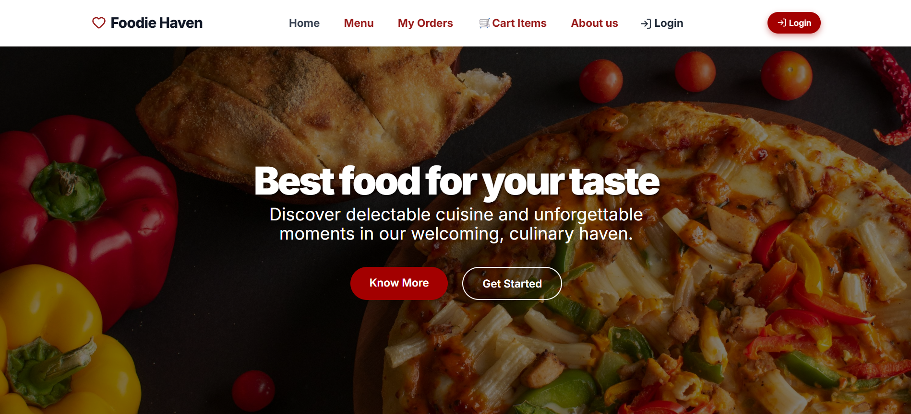
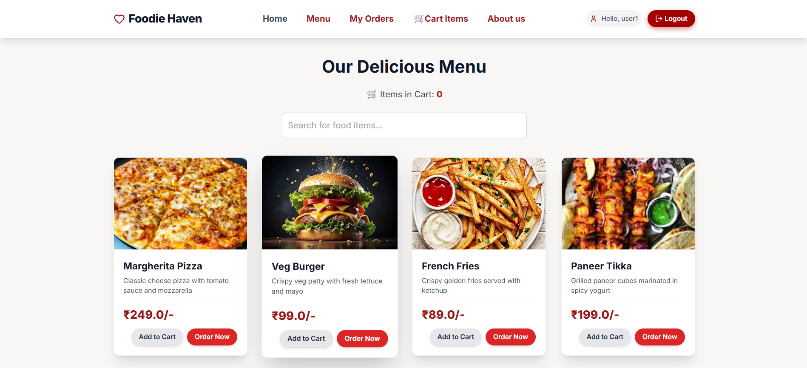
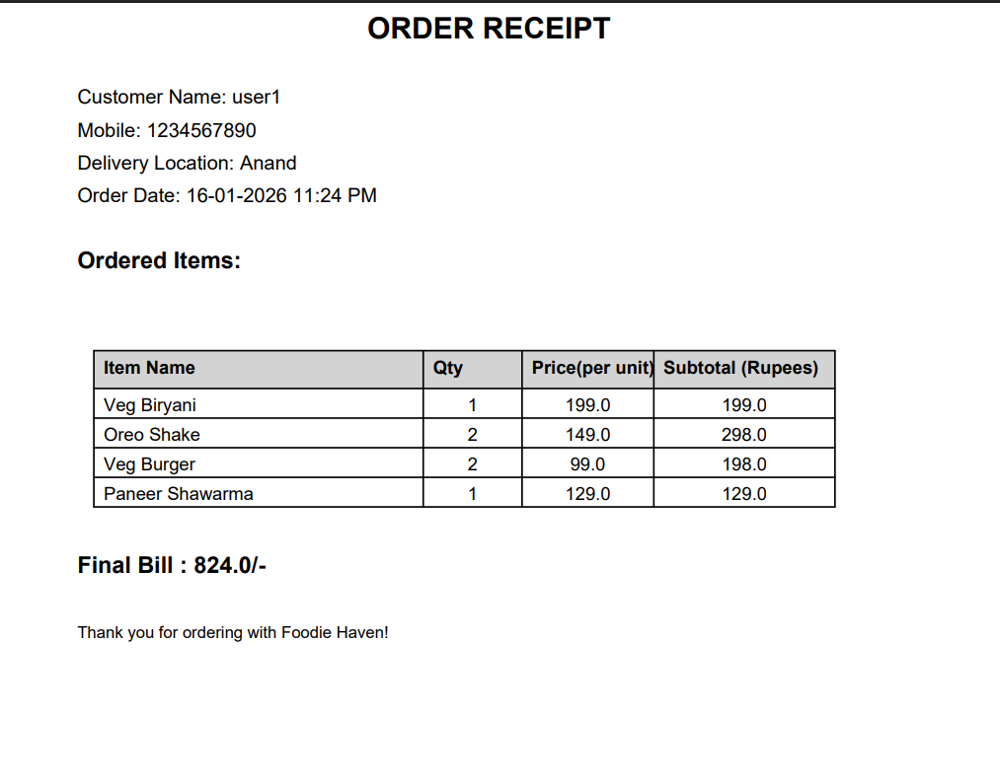
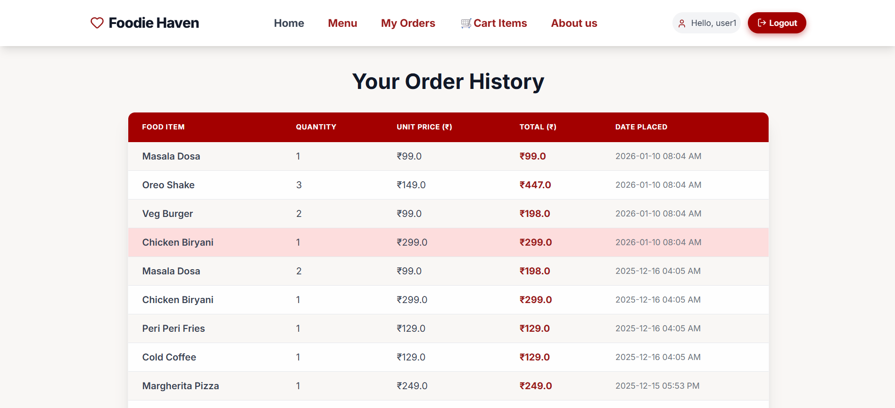
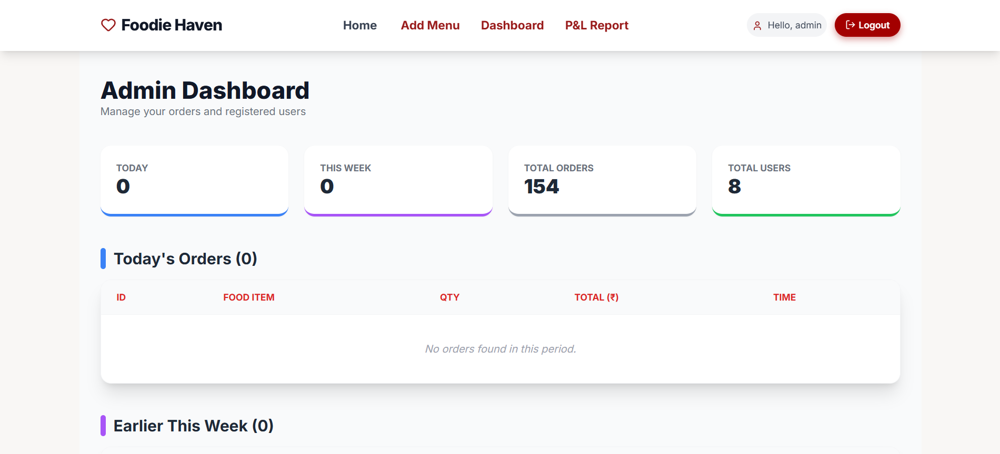

🍽️ Online Food Ordering System (Python Flask)

A simple and functional Online Food Ordering System developed using Python Flask and SQLite. This project allows users to browse food items, place orders, and download order receipts in PDF format, while admins can manage menus and view orders through an admin panel.

🚀 Features

👤 User Features

Browse available food items,
Place food orders,
Download order receipt as PDF,
Simple and user-friendly interface.

🔐 Admin Features

Secure admin panel,
Add, update, and delete food menu items,
View all customer orders,
Track monthly orders,
View registered users.

🛠️ Technologies Used

Backend: Python, Flask
Frontend: HTML, CSS, Bootstrap
Database: SQLite

<pre>PDF Generation: ReportLab / Flask utilities

📸 Project Screenshots
🏠 Home Page
🛒 Food Menu
🧾 Order & PDF Receipt
🛠 Admin Dashboard

</pre>
⚙️ How to Run the Project

Navigate to the project folder:
cd Online-Food-Ordering-System-Python-Flask-

Install required packages:
pip install flask

Run the application:
python app.py

Open your browser and visit:
http://127.0.0.1:5000/

🎯 Learning Outcomes
Hands-on experience with Flask framework
Understanding of CRUD operations with SQLite
PDF generation in web applications
Admin panel and role-based features
Web application workflow

📌 Future Enhancements
User authentication & login system
Online payment gateway integration
Order tracking system
Improved UI/UX

👩‍💻 Author

Shifa Saiyad
IT Student | Python & Flask Learner

## Project Screenshots

.png)

